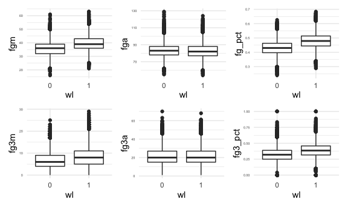
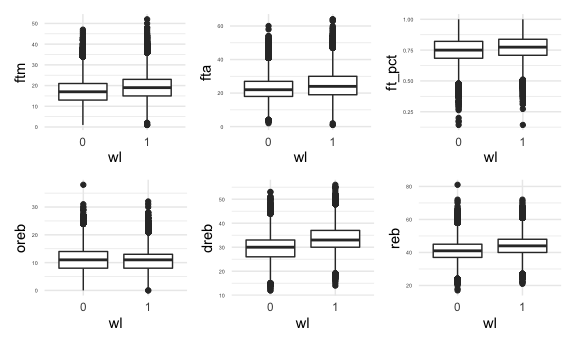
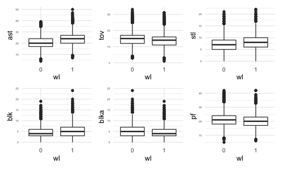
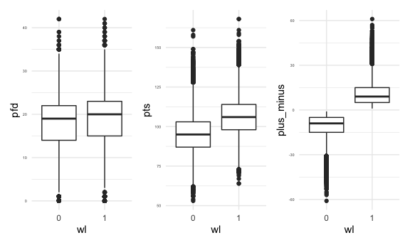
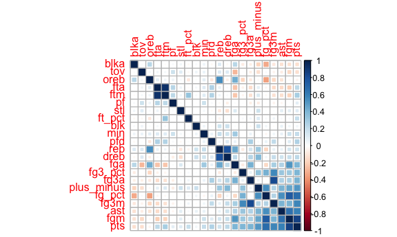
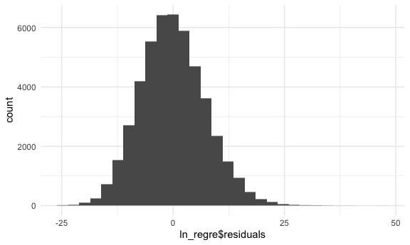
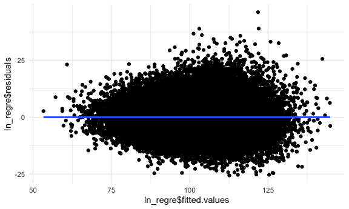

second\_regression
================
2021/11/15

## Section Introduction

In the first regression analysis, we have known that there are some
factors significantly contributing to the number of winnings, especially
some factors about three-pointer. In this section, we will continue
explore the relationships between factors of all aspects and the scores
made in every game, by using data from every game in the last 20 years
in NBA and using logistic regression to analyze what factors might
affect the game’s score to try to find out what New York Knicks needs to
improve for achieving higher score.

``` r
knitr::opts_chunk$set(
  fig.width = 6,
  fig.asp = .6,
  out.width = "90%"
)

theme_set(theme_minimal() + theme(legend.position = "bottom"))

options(
  ggplot2.continuous.colour = "viridis",
  ggplot2.continuous.fill = "viridis"
)

scale_colour_discrete = scale_colour_viridis_d
scale_fill_discrete = scale_fill_viridis_d
```

## Data

``` r
box_score_all = read_csv("./data2/box_score_all.csv")
```

    ## Rows: 47830 Columns: 30

    ## ── Column specification ────────────────────────────────────────────────────────
    ## Delimiter: ","
    ## chr   (6): season_year, team_abbreviation, team_name, game_id, matchup, wl
    ## dbl  (23): team_id, min, fgm, fga, fg_pct, fg3m, fg3a, fg3_pct, ftm, fta, ft...
    ## dttm  (1): game_date

    ## 
    ## ℹ Use `spec()` to retrieve the full column specification for this data.
    ## ℹ Specify the column types or set `show_col_types = FALSE` to quiet this message.

The box\_score\_all dataset contains 47830 games’ data from season
2012-2013 to season 2020-2021, which includes 30 variables. We are going
to use some of them in the following exploratory data analysis.

## Descriptive Statistics

We should delete some variables which are not applicable for regression
analysis, like season\_year, team\_id and some rank variables.Then
select the reasonable variables to analyze to create a data set called
“regre\_df”, and use regre\_df to draw boxplots of comparison of winning
team and losing team.

These are some reasonable variables that should be added into the
regression model:

-   wl: Win/Loss
-   min: minutes
-   pts: Points
-   fgm: Field Goals Made
-   fga: Field Goals Attempted
-   fg\_pct: Field Goal Percentage
-   fg3m: 3 Point Field Goals Made
-   fg3a: 3 Point Field Goals Attempted
-   fg3\_pct: 3 Point Field Goals Percentage
-   ftm: Free Throws Made
-   fta: Free Throws Attempted
-   ft\_pct: Free Throw Percentage
-   oreb: Offensive Rebounds
-   dreb: Defensive Rebounds
-   reb: Rebounds
-   ast: Assists
-   stl: STL
-   blk: Blocks
-   blka: Blocks Attempted
-   tov: Turnovers
-   pf: Personal Fouls
-   pfd: Personal Fouls Drawn
-   plus\_minus: Plus-Minus

In order to build logistic regression model, we will replace win/loss
with 1/0. Then draw boxplots of every variable to compare the
characteristics of winning and losing teams.

``` r
regre_df = 
  box_score_all %>%
  select(-c(1:7)) %>%
  select(-ends_with("rank")) %>%
  mutate(wl = recode(wl, "W" = 1, "L" = 0),
         wl = as.factor(wl)) 


fgm_box = 
  regre_df %>%
  group_by(wl) %>%
  mutate(fgm = as.numeric(fgm)) %>%
  ggplot(aes(x = wl, y = fgm, group=wl)) + 
  geom_boxplot() +
  theme(axis.text.y = element_text(size=4))
fga_box = 
  regre_df %>%
  group_by(wl) %>%
  mutate(fga = as.numeric(fga)) %>%
  ggplot(aes(x = wl, y = fga, group=wl)) + 
  geom_boxplot() +
  theme(axis.text.y = element_text(size=4))
fgpct_box = 
  regre_df %>%
  group_by(wl) %>%
  mutate(fg_pct = as.numeric(fg_pct)) %>%
  ggplot(aes(x = wl, y = fg_pct, group=wl)) + 
  geom_boxplot() +
  theme(axis.text.y = element_text(size=4))
fg3m_box = 
  regre_df %>%
  group_by(wl) %>%
  mutate(fg3m = as.numeric(fg3m)) %>%
  ggplot(aes(x = wl, y = fg3m, group=wl)) + 
  geom_boxplot() +
  theme(axis.text.y = element_text(size=4))
fg3a_box = 
  regre_df %>%
  group_by(wl) %>%
  mutate(fg3a = as.numeric(fg3a)) %>%
  ggplot(aes(x = wl, y = fg3a, group=wl)) + 
  geom_boxplot() +
  theme(axis.text.y = element_text(size=4))
fg3pct_box = 
  regre_df %>%
  group_by(wl) %>%
  mutate(fg3_pct = as.numeric(fg3_pct)) %>%
  ggplot(aes(x = wl, y = fg3_pct, group=wl)) + 
  geom_boxplot() +
  theme(axis.text.y = element_text(size=4))
ftm_box = 
  regre_df %>%
  group_by(wl) %>%
  mutate(ftm = as.numeric(ftm)) %>%
  ggplot(aes(x = wl, y = ftm, group=wl)) + 
  geom_boxplot() +
  theme(axis.text.y = element_text(size=4))
fta_box = 
  regre_df %>%
  group_by(wl) %>%
  mutate(ftm = as.numeric(fta)) %>%
  ggplot(aes(x = wl, y = fta, group=wl)) + 
  geom_boxplot() +
  theme(axis.text.y = element_text(size=4))
ftpct_box = 
  regre_df %>%
  group_by(wl) %>%
  mutate(ft_pct = as.numeric(ft_pct)) %>%
  ggplot(aes(x = wl, y = ft_pct, group=wl)) + 
  geom_boxplot() +
  theme(axis.text.y = element_text(size=4))
oreb_box = 
  regre_df %>%
  group_by(wl) %>%
  mutate(oreb = as.numeric(oreb)) %>%
  ggplot(aes(x = wl, y = oreb, group=wl)) + 
  geom_boxplot() +
  theme(axis.text.y = element_text(size=4))
dreb_box = 
  regre_df %>%
  group_by(wl) %>%
  mutate(dreb = as.numeric(dreb)) %>%
  ggplot(aes(x = wl, y = dreb, group=wl)) + 
  geom_boxplot() +
  theme(axis.text.y = element_text(size=4))
reb_box = 
  regre_df %>%
  group_by(wl) %>%
  mutate(reb = as.numeric(reb)) %>%
  ggplot(aes(x = wl, y = reb, group=wl)) + 
  geom_boxplot() +
  theme(axis.text.y = element_text(size=4))
ast_box = 
  regre_df %>%
  group_by(wl) %>%
  mutate(ast = as.numeric(ast)) %>%
  ggplot(aes(x = wl, y = ast, group=wl)) + 
  geom_boxplot() +
  theme(axis.text.y = element_text(size=4))
tov_box = 
  regre_df %>%
  group_by(wl) %>%
  mutate(tov = as.numeric(tov)) %>%
  ggplot(aes(x = wl, y = tov, group=wl)) + 
  geom_boxplot() +
  theme(axis.text.y = element_text(size=4))
stl_box = 
  regre_df %>%
  group_by(wl) %>%
  mutate(stl = as.numeric(stl)) %>%
  ggplot(aes(x = wl, y = stl, group=wl)) + 
  geom_boxplot() +
  theme(axis.text.y = element_text(size=4))
blk_box = 
  regre_df %>%
  group_by(wl) %>%
  mutate(blk = as.numeric(blk)) %>%
  ggplot(aes(x = wl, y = blk, group=wl)) + 
  geom_boxplot() +
  theme(axis.text.y = element_text(size=4))
blka_box = 
  regre_df %>%
  group_by(wl) %>%
  mutate(blka = as.numeric(blka)) %>%
  ggplot(aes(x = wl, y = blka, group=wl)) + 
  geom_boxplot() +
  theme(axis.text.y = element_text(size=4))
pf_box = 
  regre_df %>%
  group_by(wl) %>%
  mutate(pf = as.numeric(pf)) %>%
  ggplot(aes(x = wl, y = pf, group=wl)) + 
  geom_boxplot() +
  theme(axis.text.y = element_text(size=4))
pfd_box = 
  regre_df %>%
  group_by(wl) %>%
  mutate(pfd = as.numeric(pfd)) %>%
  ggplot(aes(x = wl, y = pfd, group=wl)) + 
  geom_boxplot() +
  theme(axis.text.y = element_text(size=4))
pts_box = 
  regre_df %>%
  group_by(wl) %>%
  mutate(pts = as.numeric(pts)) %>%
  ggplot(aes(x = wl, y = pts, group=wl)) + 
  geom_boxplot() +
  theme(axis.text.y = element_text(size=4))
pm_box = 
  regre_df %>%
  group_by(wl) %>%
  mutate(plus_minus = as.numeric(plus_minus)) %>%
  ggplot(aes(x = wl, y = plus_minus, group=wl)) + 
  geom_boxplot() +
  theme(axis.text.y = element_text(size=4))
(fgm_box + fga_box + fgpct_box) / (fg3m_box + fg3a_box + fg3pct_box)
```



``` r
(ftm_box + fta_box + ftpct_box)/(oreb_box + dreb_box + reb_box)
```



``` r
(ast_box + tov_box + stl_box) /(blk_box + blka_box + pf_box)
```



``` r
pfd_box + pts_box + pm_box
```


According to boxplots of winning and losing teams, we can find that
there are some obvious difference in some aspects, like fg\_pct,
fg3\_pct, pts and etc.

## Corralation Map

Further, we can draw a correlation map to exam correlation of variables
to help us select variables when building model.

``` r
regre_df = 
  regre_df %>%
  mutate(
    min = as.numeric(min),
    fgm = as.numeric(fgm),
    fga = as.numeric(fga),
    fg_pct = as.numeric(fg_pct),
    fg3m = as.numeric(fg3m),
    fg3a = as.numeric(fg3a),
    fg3_pct = as.numeric(fg3_pct),
    ftm = as.numeric(ftm),
    fta = as.numeric(fta),
    ft_pct = as.numeric(ft_pct),
    oreb = as.numeric(oreb),
    dreb = as.numeric(dreb),
    reb = as.numeric(reb),
    ast = as.numeric(ast),
    tov = as.numeric(tov),
    stl = as.numeric(stl),
    blk = as.numeric(blk),
    blka = as.numeric(blka),
    pf = as.numeric(pf),
    pfd = as.numeric(pfd),
    pts = as.numeric(pts),
    plus_minus = as.numeric(plus_minus)
  )
corr <- cor(regre_df[-1])
corrplot(corr, method = "square", order = "FPC")
```



Based on this plot, we can see that there are some strong correlation
between some variables, like ftm and fta, dreb and reb. We will select
one variable from a pair of variables that have correlation score which
is more than 0.5. Therefore we can select variables which have no strong
correlation with others.

## Linear Regression

### Variable description

After ruling out variables with strong correlation, we include variables
as follow: Dependent variable is the score of each game, denoted by pts
(points). Independent variables are selected from both **offensive**
aspect and **defensive** aspect.

For the offensive level, variables include:

-   fg3\_pct: proportion of three points shooting
-   fg\_pct: proportion of field goals attempted
-   fg\_pct: proportion of free throw
-   oreb: average offensive rebounds per game
-   ast: average assists per games

As for the defensive level, variables include:

-   stl: steals of each game
-   blk: blocks of each game
-   dreb: defensive rebounds of each game
-   tov: turnovers of each game
-   pf: personal foul of each game

### Modelling

Use step function to choose a model by AIC in a Stepwise algorithm.

``` r
ln_regre = lm(pts ~fg_pct+fg3_pct+ft_pct+oreb+dreb+ast+stl+blk+tov+pf,data = regre_df)
summary(ln_regre)
```

    ## 
    ## Call:
    ## lm(formula = pts ~ fg_pct + fg3_pct + ft_pct + oreb + dreb + 
    ##     ast + stl + blk + tov + pf, data = regre_df)
    ## 
    ## Residuals:
    ##     Min      1Q  Median      3Q     Max 
    ## -25.617  -5.038  -0.342   4.710  46.223 
    ## 
    ## Coefficients:
    ##               Estimate Std. Error t value Pr(>|t|)    
    ## (Intercept) -25.229423   0.515913  -48.90   <2e-16 ***
    ## fg_pct      138.594897   0.803307  172.53   <2e-16 ***
    ## fg3_pct      14.564180   0.325892   44.69   <2e-16 ***
    ## ft_pct       24.290515   0.331887   73.19   <2e-16 ***
    ## oreb          0.802525   0.009228   86.96   <2e-16 ***
    ## dreb          0.563889   0.006492   86.86   <2e-16 ***
    ## ast           0.487421   0.008136   59.91   <2e-16 ***
    ## stl           0.565725   0.011870   47.66   <2e-16 ***
    ## blk          -0.152531   0.013351  -11.43   <2e-16 ***
    ## tov          -0.682900   0.008899  -76.74   <2e-16 ***
    ## pf            0.404912   0.007667   52.81   <2e-16 ***
    ## ---
    ## Signif. codes:  0 '***' 0.001 '**' 0.01 '*' 0.05 '.' 0.1 ' ' 1
    ## 
    ## Residual standard error: 7.334 on 47819 degrees of freedom
    ## Multiple R-squared:  0.6916, Adjusted R-squared:  0.6916 
    ## F-statistic: 1.072e+04 on 10 and 47819 DF,  p-value: < 2.2e-16

``` r
linear.step = step(ln_regre,direction="both")
```

    ## Start:  AIC=190616
    ## pts ~ fg_pct + fg3_pct + ft_pct + oreb + dreb + ast + stl + blk + 
    ##     tov + pf
    ## 
    ##           Df Sum of Sq     RSS    AIC
    ## <none>                 2572088 190616
    ## - blk      1      7021 2579109 190744
    ## - fg3_pct  1    107426 2679514 192571
    ## - stl      1    122170 2694258 192834
    ## - pf       1    150024 2722112 193325
    ## - ast      1    193050 2765138 194076
    ## - ft_pct   1    288123 2860211 195692
    ## - tov      1    316762 2888850 196169
    ## - dreb     1    405789 2977877 197621
    ## - oreb     1    406778 2978867 197637
    ## - fg_pct   1   1601094 4173182 213762

``` r
summary(linear.step)
```

    ## 
    ## Call:
    ## lm(formula = pts ~ fg_pct + fg3_pct + ft_pct + oreb + dreb + 
    ##     ast + stl + blk + tov + pf, data = regre_df)
    ## 
    ## Residuals:
    ##     Min      1Q  Median      3Q     Max 
    ## -25.617  -5.038  -0.342   4.710  46.223 
    ## 
    ## Coefficients:
    ##               Estimate Std. Error t value Pr(>|t|)    
    ## (Intercept) -25.229423   0.515913  -48.90   <2e-16 ***
    ## fg_pct      138.594897   0.803307  172.53   <2e-16 ***
    ## fg3_pct      14.564180   0.325892   44.69   <2e-16 ***
    ## ft_pct       24.290515   0.331887   73.19   <2e-16 ***
    ## oreb          0.802525   0.009228   86.96   <2e-16 ***
    ## dreb          0.563889   0.006492   86.86   <2e-16 ***
    ## ast           0.487421   0.008136   59.91   <2e-16 ***
    ## stl           0.565725   0.011870   47.66   <2e-16 ***
    ## blk          -0.152531   0.013351  -11.43   <2e-16 ***
    ## tov          -0.682900   0.008899  -76.74   <2e-16 ***
    ## pf            0.404912   0.007667   52.81   <2e-16 ***
    ## ---
    ## Signif. codes:  0 '***' 0.001 '**' 0.01 '*' 0.05 '.' 0.1 ' ' 1
    ## 
    ## Residual standard error: 7.334 on 47819 degrees of freedom
    ## Multiple R-squared:  0.6916, Adjusted R-squared:  0.6916 
    ## F-statistic: 1.072e+04 on 10 and 47819 DF,  p-value: < 2.2e-16

The adjusted R square for the full model is 0.6916, that is to say
69.16% of variances in the response variable can be explained by the
predictors.

### Model diagnostic

1). to check if the error term is normally distributed with mean 0.

``` r
ggplot(data = ln_regre , aes(x = ln_regre$residuals)) + geom_histogram()
```

    ## `stat_bin()` using `bins = 30`. Pick better value with `binwidth`.



Condition 1 is met.

2). to check if the error term is independent of the dependent variable.

``` r
ggplot(data = ln_regre, aes(x = ln_regre$fitted.values, y = ln_regre$residuals)) + geom_point() + geom_smooth(method = "lm")
```

    ## `geom_smooth()` using formula 'y ~ x'



Condition 2 is met as we cannot see an obvious tendency of errors.

### Interpretation of model coefficients

According to model ln\_regre,the equation will look like this.


All variables selected are significant in this linear regression model.

For each additional 0.1 of proportion of field goals attempted, the
points will increase 13.9.

For each additional 0.1 of proportion three points shooting, the points
will increase 1.45.

For each additional 0.1 of proportion of free throw, the points will
increase 2.43.

For each additional 1 of offensive rebounds per game, the points will
increase 0.8.

For each additional 1 of defensive rebounds per games, the points will
increase 0.56.

For each additional 1 of steals per game, the points will increase 0.57.

For each additional 1 of assists per game, the points will increase
0.45.

For each additional 1 of blocks per game, the points will decrease 0.15.

For each additional 1 of turnovers per game, the points will decrease
0.68.

For each additional 1 of personal foul per game, the points will
decrease 0.4.

## Logistic Regression

Separate data as 80% training data and 20% testing data for prediction.

``` r
set.seed(22)
train.index <- sample(x=1:nrow( regre_df), size=ceiling(0.9*nrow(regre_df)))

train = regre_df[train.index, ]
test =regre_df[-train.index, ]
```

### Modelling

Build logistic regression model with Step methods in both directions.

``` r
lg_regre<-glm(wl~fg_pct+fg3_pct+ft_pct+oreb+dreb+ast+stl+blk+tov+pf,data =train, family = "binomial",control = list(maxit=1000))
summary(lg_regre)
```

    ## 
    ## Call:
    ## glm(formula = wl ~ fg_pct + fg3_pct + ft_pct + oreb + dreb + 
    ##     ast + stl + blk + tov + pf, family = "binomial", data = train, 
    ##     control = list(maxit = 1000))
    ## 
    ## Deviance Residuals: 
    ##     Min       1Q   Median       3Q      Max  
    ## -3.3302  -0.6406   0.0198   0.6309   3.2524  
    ## 
    ## Coefficients:
    ##               Estimate Std. Error z value Pr(>|z|)    
    ## (Intercept) -25.150274   0.282380  -89.06   <2e-16 ***
    ## fg_pct       30.300719   0.394694   76.77   <2e-16 ***
    ## fg3_pct       4.300476   0.132209   32.53   <2e-16 ***
    ## ft_pct        3.626952   0.133934   27.08   <2e-16 ***
    ## oreb          0.169106   0.003828   44.18   <2e-16 ***
    ## dreb          0.237543   0.003153   75.35   <2e-16 ***
    ## ast          -0.040846   0.003216  -12.70   <2e-16 ***
    ## stl           0.263265   0.005102   51.60   <2e-16 ***
    ## blk           0.120397   0.005340   22.55   <2e-16 ***
    ## tov          -0.177678   0.003778  -47.03   <2e-16 ***
    ## pf           -0.067135   0.003050  -22.01   <2e-16 ***
    ## ---
    ## Signif. codes:  0 '***' 0.001 '**' 0.01 '*' 0.05 '.' 0.1 ' ' 1
    ## 
    ## (Dispersion parameter for binomial family taken to be 1)
    ## 
    ##     Null deviance: 59676  on 43046  degrees of freedom
    ## Residual deviance: 35814  on 43036  degrees of freedom
    ## AIC: 35836
    ## 
    ## Number of Fisher Scoring iterations: 5

``` r
logit.step = step(lg_regre,direction="both")
```

    ## Start:  AIC=35835.62
    ## wl ~ fg_pct + fg3_pct + ft_pct + oreb + dreb + ast + stl + blk + 
    ##     tov + pf
    ## 
    ##           Df Deviance   AIC
    ## <none>          35814 35836
    ## - ast      1    35976 35996
    ## - pf       1    36310 36330
    ## - blk      1    36335 36355
    ## - ft_pct   1    36576 36596
    ## - fg3_pct  1    36932 36952
    ## - oreb     1    37957 37977
    ## - tov      1    38287 38307
    ## - stl      1    38869 38889
    ## - dreb     1    43635 43655
    ## - fg_pct   1    44015 44035

``` r
summary(logit.step)
```

    ## 
    ## Call:
    ## glm(formula = wl ~ fg_pct + fg3_pct + ft_pct + oreb + dreb + 
    ##     ast + stl + blk + tov + pf, family = "binomial", data = train, 
    ##     control = list(maxit = 1000))
    ## 
    ## Deviance Residuals: 
    ##     Min       1Q   Median       3Q      Max  
    ## -3.3302  -0.6406   0.0198   0.6309   3.2524  
    ## 
    ## Coefficients:
    ##               Estimate Std. Error z value Pr(>|z|)    
    ## (Intercept) -25.150274   0.282380  -89.06   <2e-16 ***
    ## fg_pct       30.300719   0.394694   76.77   <2e-16 ***
    ## fg3_pct       4.300476   0.132209   32.53   <2e-16 ***
    ## ft_pct        3.626952   0.133934   27.08   <2e-16 ***
    ## oreb          0.169106   0.003828   44.18   <2e-16 ***
    ## dreb          0.237543   0.003153   75.35   <2e-16 ***
    ## ast          -0.040846   0.003216  -12.70   <2e-16 ***
    ## stl           0.263265   0.005102   51.60   <2e-16 ***
    ## blk           0.120397   0.005340   22.55   <2e-16 ***
    ## tov          -0.177678   0.003778  -47.03   <2e-16 ***
    ## pf           -0.067135   0.003050  -22.01   <2e-16 ***
    ## ---
    ## Signif. codes:  0 '***' 0.001 '**' 0.01 '*' 0.05 '.' 0.1 ' ' 1
    ## 
    ## (Dispersion parameter for binomial family taken to be 1)
    ## 
    ##     Null deviance: 59676  on 43046  degrees of freedom
    ## Residual deviance: 35814  on 43036  degrees of freedom
    ## AIC: 35836
    ## 
    ## Number of Fisher Scoring iterations: 5

### Interpretation of model coefficients

For logistic regression, we can explain variables from the perspective
of odds.

All variables selected are significant in this logistic regression
model.

For each additional 1 of proportion of field goals attempted, the odds
of win over loss will become e^30.300719 times.

For each additional 1 of proportion three points shooting, the odds of
win over loss will become e^4.300476 times.

For each additional 1 of proportion of free throw, the odds of win over
loss will become e^3.626952 times.

For each additional 1 of offensive rebounds per game, the odds of win
over loss will become e^0.169106 times.

For each additional 1 of defensive rebounds per games, the odds of win
over loss will become e^0.237543 times.

For each additional 1 of steals per game, the odds of win over loss will
become e^0.263265 times.

For each additional 1 of assists per game, the odds of win over loss
will become e^(-0.040846) times.

For each additional 1 of blocks per game, the odds of win over loss will
become e^0.120397 times.

For each additional 1 of turnovers per game, the odds of win over loss
will become e^(-0.177678) times.

For each additional 1 of personal foul per game, the odds of win over
loss will become e^(-0.067135) times.

### Calculate prediction accuracy.

``` r
probabilities <- lg_regre %>% predict(test, type = "response")
head(probabilities)
```

    ##         1         2         3         4         5         6 
    ## 0.9599067 0.1557291 0.9642265 0.4626808 0.9066939 0.4378931

``` r
contrasts(test$wl)
```

    ##   1
    ## 0 0
    ## 1 1

``` r
predicted.classes <- ifelse(probabilities > 0.5, "1", "0")
head(predicted.classes)
```

    ##   1   2   3   4   5   6 
    ## "1" "0" "1" "0" "1" "0"

``` r
mean(predicted.classes == test$wl)
```

    ## [1] 0.8053523

Using the logistic model of all variables we selected, the prediction
accuracy is 0.8053523.

## Conclusion

-   We have built both linear and logistic regression based on the NBA
    data. The adjusted R square for the linear regression model is
    0.6916, which can explain the game score in a large extent. And the
    prediction of the logistic regression model is 0.8053523, which can
    help us to predict the result of a game more accurately.

-   There are some variables that can positively attribute to the
    winning of a game in both two models, like proportion of field goals
    attempted, proportion three points shooting and proportion of free
    throw, which can instruct the Knicks to pay more attention on these
    aspects in daily training.

-   There is variable that can negatively attribute to the winning of a
    game in both two models, turnovers, which can instruct the Knicks to
    avoid this action in games.
